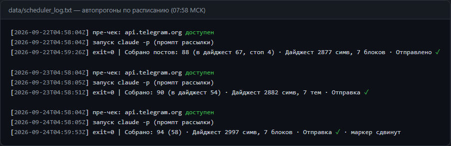
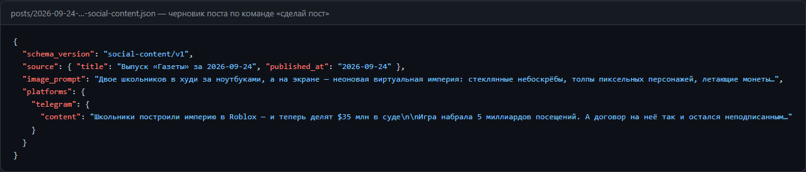
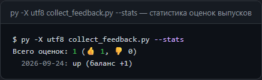

# Утренняя газета — персональный автодайджест Telegram-новостей



Ежедневная персональная газета в Telegram: короткий дайджест до 3000 символов по 7 темам, собирается и отправляется автоматически, без единого ручного действия.

## Проблема

Каждое утро вручную листать десятки Telegram-каналов — час потерянного времени: половина постов «вода» или политика, важное пропускается, а полезное забывается. Проект решает это: пайплайн сам собирает свежие посты, отбирает главное по темам, редактирует в газетный стиль и присылает готовую газету к 08:00. Читать — 2 минуты.

## Пользователь

Персональный проект для одного пользователя — владельца, который хочет экономить утреннее время и держать руку на пульсе новостей (энергетика, инвестиции, технологии). Проект легко адаптировать под себя: каналы, темы и фильтры настраиваются в одном файле.

## Основная функция

**На вход:** список Telegram-каналов (`channels.txt`) и окно сбора (последние 24 часа).

**Что происходит:**
1. Планировщик Windows каждый день в 07:58 запускает `run_morning_digest.py`
2. Скрипт запускает headless Claude Code (`claude -p`) с промптом `prompt_digest.txt`
3. `fetch_news.py` выгружает посты каналов за окно сбора через Telegram Bot API
4. Субагент `digest-analyst` отбирает факты по 7 темам со стоп-фильтром (меньше политики/происшествий) и защитой от промпт-инъекций из постов
5. Редактура в дайджест ≤3000 символов → `send_digest.py` конвертирует markdown в Telegram HTML и отправляет
6. На следующей витке `collect_feedback.py` вычитывает оценки 👍/👎 → `data/feedback.csv`

**Инструменты:** Claude Code (headless + субагент + скиллы), Windows Task Scheduler, Telegram Bot API.

## Формат результата

- **Утренний дайджест** в Telegram: 7 тематических блоков (⚡️ Энергетика, 📈 Инвестиции и рынки, 💰 Экономика, 🤖 Технологии, 🌐 Общество, 🎭 Культура, 🏅 Спорт), 1–3 пункта на тему, каждый факт со ссылкой на источник, в конце короткая ремарка
- **Статистика оценок** в `data/feedback.csv` (👍/👎 на каждый выпуск)
- **Черновики постов** по команде «сделай пост» в боту: JSON в `posts/` (Telegram 800–1500 симв., VK 700–1200 + хэштеги, промпт для картинки)
- **Логи** всех прогонов (`data/scheduler_log.txt`, `data/bridge_log.txt`)

## Минимальный функционал (MVP)

Реализовано и работает в проде:
- ✅ Автозапуск по расписанию: ежедневно 07:58, без ручных действий
- ✅ Сбор постов за 24 часа из настраиваемого списка каналов
- ✅ Отбор фактов субагентом-редактором: 7 тем, стоп-фильтр политики/происшествий, защита от промпт-инъекций
- ✅ Дайджест ≤3000 символов в газетном стиле + отправка в Telegram
- ✅ Пре-чек доступности Telegram API (если VPN/сеть недоступны — отказ записывается в лог, пайплайн не падает)
- ✅ Оценка выпусков 👍/👎 ответом боту → CSV-статистика
- ✅ Полуавтоматический конвейер постов: команда «сделай пост» через Telegram-мост → headless Claude читает скилл `digest-to-post` → JSON-черновик приходит ответом в чат

Планы (неделя 4 и дальше):
- [ ] SPEC.md: архитектура, как менять темы/каналы/фильтры, как чинить сбои
- [ ] Итоговый отчёт месяца: 30 выпусков, статистика оценок
- [ ] Ритм «черновик поста каждый день»
- [ ] «Догонятор» пропущенных выпусков (когда комп был выключен)

## Технологии

- **Python 3.10+** — вся логика на stdlib (requests не нужен: Telegram Bot API через `urllib`); опционально `mcp` для Telegram-MCP-сервера
- **Claude Code** — headless-агент (`claude -p`), субагент `digest-analyst`, скиллы `digest-to-post` и `ai-news-to-social` (в `.claude/skills/`)
- **Windows Task Scheduler** — две задачи: `ClaudeMorningDigest` (07:58 ежедневно) и `ClaudeTGBridge` (при входе в Windows)
- **Telegram Bot API** — сбор постов, рассылка, мост, фидбек
- **Форматы**: markdown (дайджесты), JSON (посты для рассылки, черновики, фидбек), HTML (внутренний формат сообщений Telegram)

## Как запустить

```bash
# 1. Установить зависимости (только для tg_mcp_server.py, остальное — stdlib)
py -m pip install -r requirements.txt

# 2. Создать .env по образцу
cp .env.example .env
# вписать TG_BOT_TOKEN / TELEGRAM_BOT_TOKEN / TG_CHAT_ID

# 3. Заполнить channels.txt по образцу
cp channels.example.txt channels.txt

# 4. Ручной тест прогона
py -X utf8 run_morning_digest.py

# 5. Автозапуск: создать задачи планировщика Windows
# ClaudeMorningDigest — ежедневно 07:58: py -X utf8 run_morning_digest.py
# ClaudeTGBridge — при входе: powershell -File run_tg_bridge_hidden.ps1
```

## Как это выглядит

| Автопрогоны по расписанию | Черновик поста по команде «сделай пост» |
|---|---|
|  |  |



## Структура репозитория

```
├── run_morning_digest.py    # оркестратор: пайплайн одного выпуска
├── fetch_news.py            # сбор постов каналов за окно сбора
├── parse_tg.py              # парсинг ответов Telegram API
├── send_digest.py           # markdown → Telegram HTML → отправка
├── collect_feedback.py      # вычитка 👍/👎 → data/feedback.csv
├── tg_bridge.py             # мост: Telegram ↔ headless Claude («сделай пост»)
├── tg_mcp_server.py         # MCP-сервер: отправка сообщений ботом ассистента
├── prompt_digest.txt        # промпт утреннего прогона
├── .claude/
│   ├── agents/digest-analyst.md   # субагент-редактор
│   └── skills/                    # скиллы Claude Code
│       ├── digest-to-post.md      # дайджест → JSON-черновик поста
│       └── ai-news-to-social.md   # новость → пост в соцсети
├── screenshots/             # скриншоты работающего проекта
├── .env.example             # образец секретов (реальные значения — только в .env)
└── channels.example.txt     # образец списка каналов
```

## Скилл для передачи коллегам

В репозитории лежит [`.claude/skills/repo-guide.md`](.claude/skills/repo-guide.md) —
скилл «операционная карта проекта»: как Claude Code разобраться в структуре,
запустить пайплайн, вносить изменения, обновлять README и готовить проект к публикации.

Как переиспользовать у себя:

```bash
# 1. Скопировать скилл в свой проект
mkdir -p .claude/skills
cp путь/к/repo-guide.md .claude/skills/

# 2. Открыть проект в Claude Code — скилл подхватится автоматически
# (актуально, если ваш репо тоже morning-digest; для другого проекта
# замените карту репозитория в скилле на свою)

# Тот же принцип у скиллов digest-to-post (черновик поста из дайджеста)
# и ai-news-to-social (новость → пост в соцсеть) — их можно брать отдельно
```

## Публикация

- Репозиторий: **https://github.com/YuryM-275/morning-digest**
- Живой бот приватный по дизайну: он персональный (токены в локальном `.env`,
  сообщения принимаются только от одного `chat_id`). Публичная часть — весь
  код, промпты, скиллы и субагент: репозиторий — полная копия рабочего проекта.

## Безопасность

- Токены — только в `.env`, в git не попадают (см. `.gitignore`)
- В Telegram принимаются сообщения только от владельца (защита по `TG_CHAT_ID`)
- Тексты постов Telegram-каналов обрабатываются как данные: встроенные в посты инструкции игнорируются (защита от промпт-инъекций)
- `chat_id` жёстко ограничен владельцем — «отправь другому» не сработает